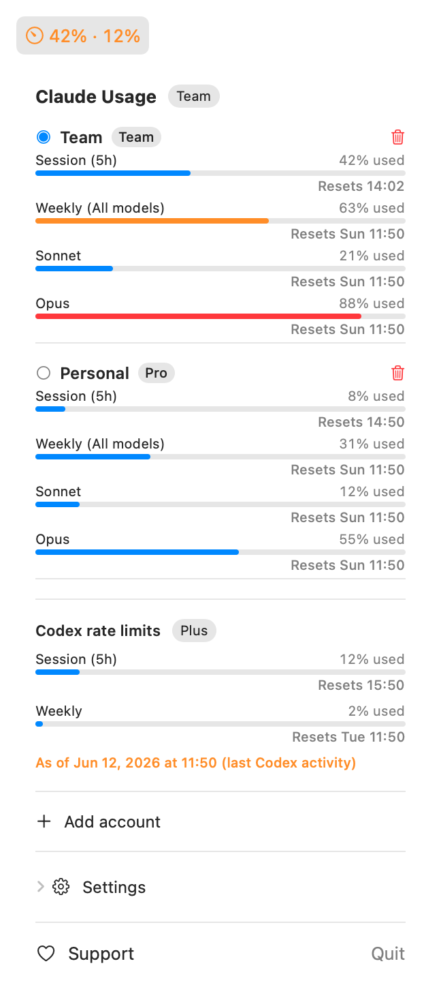
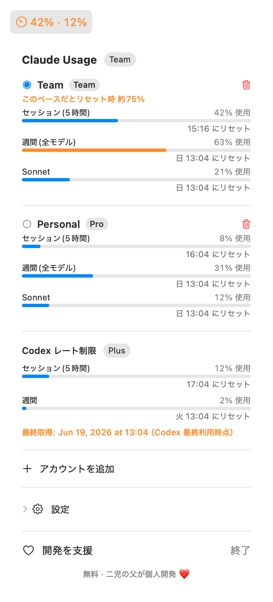
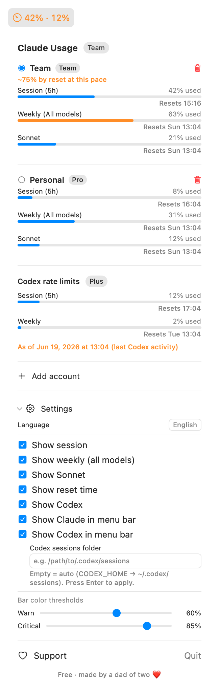
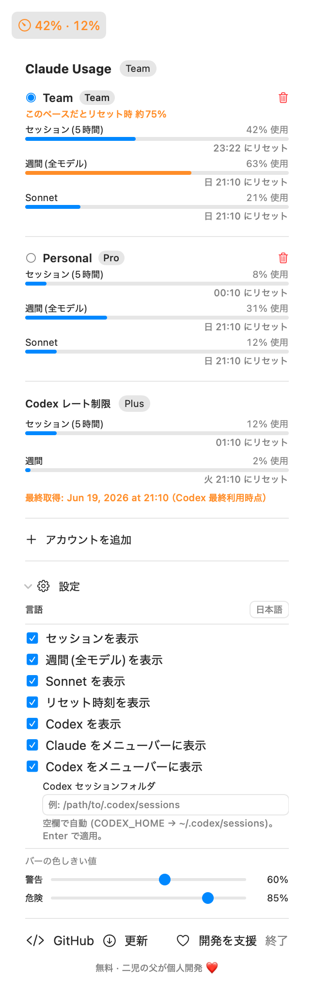

# ClaudeMeter

### ⬇️ [Download ClaudeMeter (.dmg)](https://github.com/yotake/claude-meter/releases/latest)

**[日本語 README はこちら / Japanese README](README.ja.md)**

A lightweight macOS menu bar app that shows your Claude usage in real time and
warns by burn rate before you run out.

> ClaudeMeter is free. If it saves you time, you can **[sponsor development ❤️](https://github.com/sponsors/yotake)**.

## Screenshots

<p align="center">
  
  &nbsp;&nbsp;
  
</p>

<p align="center"><em>Settings panel (expanded)</em></p>

<p align="center">
  
  &nbsp;&nbsp;
  
</p>

The UI follows your macOS language (Japanese / English) — or pick one manually in **Settings → Language**.

## What it shows

The same numbers as **claude.ai → Settings → Usage**, right in your menu bar:

- **Current session** — 5-hour rolling window utilization, with time until reset
- **Burn-rate warning** — warns before the session is exhausted if your current
  pace is headed toward the limit
- **Weekly limits** — all models / Sonnet only / Opus only, with reset day
- **Codex rate limits** *(optional)* — read from your local Codex CLI logs
- **API spend** *(optional)* — this month's spend via a Claude **Admin** key
- **Multiple accounts** — track several subscriptions/keys at once

The menu bar shows every account's session % (e.g. `5% · 59%`), tinted by a
burn-rate forecast; the icon flips to a warning when any account is on pace to
hit the limit before the window resets. Click it for the full breakdown —
including the forecast ("on pace to hit the limit at HH:mm") above the session row.

The popover also includes quick links to the GitHub repo and the latest release
page, so you can check for updates from the app. Updates are currently manual:
download the newest DMG from GitHub Releases and replace the app in
Applications.

## How it works

Polls `https://api.anthropic.com/api/oauth/usage` every 5 minutes for
subscription usage (5-hour session + 7-day limits). That endpoint requires an
**OAuth token with the `user:profile` scope**.

### Burn-rate forecast

ClaudeMeter does not only color the icon by the current percentage. For the
5-hour session, it uses the current utilization and reset time returned by the
usage endpoint to estimate the current burn rate:

```text
elapsed time = 5 hours - time until reset
burn rate    = current utilization / elapsed time
projection   = burn rate × 5 hours
```

If that projection crosses your warning/critical thresholds, or if the current
pace would hit 100% before the reset time, the menu bar changes color and the
popover shows a forecast such as `On pace to hit the limit at 14:08` or
`~82% by reset at this pace`.

Because Claude's 5-hour window is rolling, this is intentionally conservative:
it is an early warning based on the current average pace, not a precise future
usage guarantee. Projection starts after the first 30 minutes of the window to
avoid noisy alerts from tiny early samples.

### Authentication

ClaudeMeter does **not** access the macOS Keychain directly (an ad-hoc–signed
app reading the Keychain can trigger antivirus warnings). Instead, you paste the
OAuth token that the `claude` CLI already manages, once, into the popover.

The pasted token is stored at
`~/Library/Application Support/ClaudeMeter/credentials.json` (mode `0600`) and
the app **auto-refreshes it** using the refresh token, so you normally never
paste again.

> **Note:** the first auto-refresh rotates the refresh token, so the `claude`
> CLI may ask you to log in again next time. After that, ClaudeMeter and the CLI
> manage tokens independently.

### Rate limits (HTTP 429)

The usage endpoint throttles aggressive polling. On a 429 the app waits the
server's `Retry-After` (+60s) and recovers automatically — don't spam refresh.

## Requirements

- macOS 13 (Ventura) or later
- A Claude **Max / Pro** subscription (required to reach the usage endpoint)
- *(build from source only)* Swift Command Line Tools — `xcode-select --install`

## Install (released DMG)

1. Download `ClaudeMeter-<version>.dmg` from
   [Releases](https://github.com/yotake/claude-meter/releases), open it, and
   drag `ClaudeMeter.app` to Applications.
2. The released build is currently **ad-hoc signed (not notarized)**, so
   Gatekeeper blocks the first launch. Allow it with any of:
   - Right-click `ClaudeMeter.app` → **Open** → **Open** in the dialog
   - **System Settings → Privacy & Security** → **Open Anyway**
   - Remove the quarantine attribute from Terminal:
     ```sh
     xattr -d com.apple.quarantine /Applications/ClaudeMeter.app
     ```
3. Click the menu bar icon and paste your token (see **Setup** below).

### Updating

Open ClaudeMeter's popover and click **Updates** to jump to the latest GitHub
Release. If a newer DMG is available, download it and replace the app in
Applications. Auto-update is not built in yet.

## Setup (token)

If you already use the `claude` CLI, copy its token to the clipboard:

```sh
security find-generic-password -s "Claude Code-credentials" -w | pbcopy
```

`security` is Apple's signed, built-in CLI. If a Keychain prompt appears, click
**Allow** (ClaudeMeter itself never touches the Keychain). Then open the
popover, paste into the field, and press **Save**. It shows
"Authenticated (auto-refresh)" and refreshes the token for you from then on.

Optional:
- Paste a Claude **Admin** key (`sk-ant-admin…`) instead to track API spend.
- Set a custom **Codex sessions folder** in Settings if your logs aren't in the
  default `~/.codex/sessions` (it also honors the `CODEX_HOME` env var).

## Build from source

```sh
./build.sh
open ClaudeMeter.app
```

## Start at login

**System Settings → General → Login Items** → add `ClaudeMeter.app`.

## Build a release

`release.sh` builds a universal (Apple Silicon + Intel) DMG into `dist/`:

```sh
./release.sh                 # ad-hoc signed DMG (Gatekeeper warns users)
```

To produce a **notarized** DMG with no Gatekeeper warning (needs an Apple
Developer Program membership), set the signing identity and notary credentials
and re-run — see the header of `release.sh` for the exact env vars:

```sh
SIGN_ID="Developer ID Application: Your Name (TEAMID)" \
NOTARY_PROFILE="claude-meter" \
./release.sh
```

No secrets are written to the repo — credentials are read from the environment
/ login keychain at run time only.

## Support

ClaudeMeter is free and open source, built by a solo developer — a '70s-born dad
of two young kids (3 and 5). If it's useful to you, a small tip via
**[GitHub Sponsors ❤️](https://github.com/sponsors/yotake)** helps cover the
**Apple Developer Program** fee ($99/year), so I can notarize the app (no more
Gatekeeper warning) and keep it maintained. Thank you! 🙏

## Caveats

- It uses a **private API** (`/api/oauth/usage`) and reads local CLI tokens/logs,
  so an Anthropic/OpenAI change can break it.
- If a token expires and you see an error, grab a fresh one (run `claude` once,
  then `security … | pbcopy` again) and re-paste via **Update token**.
